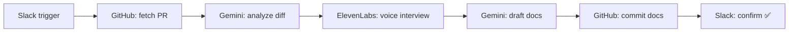

# project-tech-doc

**Auto-generate technical docs and user guides from GitHub PRs — with a voice interview to capture the author's intent.**

Trigger it from Slack, it fetches the PR, analyzes the diff, jumps on a short voice call with the author to fill in the gaps, drafts a tech doc + user guide, and commits both back to the repo.

---

## Why

Code review captures *what* changed. Commit messages occasionally capture *why*. But the nuance — the tradeoffs, the alternatives considered, the follow-ups — usually lives only in the author's head. This tool pulls that out in 2 minutes of conversation and writes it down.

---

## Pipeline



Internal events (via `@nestjs/event-emitter`): `pr.received` → `pr.ingested` → `pr.analyzed` → `voice.completed` → `docs.generated`. Any stage can emit `pr.failed` to short-circuit and notify Slack.

---

## Demo flow

In a Slack channel where the bot is installed:

```
document #PR-42 https://github.com/your-org/your-repo/pull/42
```

What you'll see in the thread:

1. `👋 Got it! Working on PR #42 — I'll post updates here.`
2. `📥 Fetched PR #42 — "Add retry middleware"` — N files, M commits
3. A voice-chat invite link — 2-minute call with an AI interviewer
4. `📝 Got your answers — writing the docs now…`
5. `✅ Documentation updated for PR #42` with paths to the committed files

Two files land on the target repo's default branch:
- `docs/technical/<module>.md` — thorough technical writeup
- `docs/guides/<module>.md` — plain-language user guide

Subsequent PRs on the same module append new sections instead of overwriting.

---

## Setup

### 1. Install

```bash
npm install
cp .env.example .env
```

### 2. Configure environment

| Variable | Source | Purpose |
|---|---|---|
| `GEMINI_API_KEY` | [aistudio.google.com](https://aistudio.google.com/apikey) | PR analysis + doc generation (`gemini-2.5-flash`) |
| `ELEVENLABS_API_KEY` | [elevenlabs.io](https://elevenlabs.io/app/settings/api-keys) | Voice interview agent |
| `SLACK_BOT_TOKEN` | Slack app — OAuth & Permissions | Posting messages (`xoxb-…`) |
| `SLACK_SIGNING_SECRET` | Slack app — Basic Information | Request verification |
| `SLACK_APP_TOKEN` | Slack app — Basic Information → App-Level Tokens | Socket Mode (`xapp-…`) |
| `GITHUB_TOKEN` | [github.com/settings/tokens](https://github.com/settings/tokens) | Read PRs, commit docs (needs `repo` scope) |
| `PORT` | — | HTTP port, defaults to `3000` |

The app validates all required vars at boot and refuses to start with a clear error if any are missing.

### 3. Slack app

Create an app at [api.slack.com/apps](https://api.slack.com/apps) and enable:

- **Socket Mode** — on (no public URL needed)
- **Bot Token Scopes**: `chat:write`, `app_mentions:read`, `channels:history`, `groups:history`, `im:history`
- **Event Subscriptions → Subscribe to bot events**: `message.channels`, `message.groups`, `message.im`
- Install the app to your workspace, invite it into a channel

### 4. Run

```bash
npm run start:dev
```

You should see the startup banner, followed by:

```
[Bootstrap] Ready — listening on http://localhost:3000
[Bootstrap] Pipeline: Slack → GitHub → Analysis → Voice → Generation → KB
[Bootstrap] Trigger in Slack: `document #PR-<number> <github-pr-url>`
[SlackService] Slack app connected via Socket Mode
```

Then post the trigger in Slack.

---

## Architecture

Each pipeline stage is a Nest module listening on one event and emitting the next. No direct calls between stages — they communicate purely through `EventEmitter2`.

```
src/
├── slack/            # Trigger listener + progress + error announcements
├── github/           # PR ingest + atomic multi-file commits (Git Data API)
├── analysis/         # Gemini structured-output JSON analysis
├── voice/            # ElevenLabs agent creation + conversation polling
├── generation/       # Parallel tech-doc + user-guide generation
├── knowledge-base/   # Append/create docs, commit, confirm
├── events/           # Event class definitions (typed payloads)
└── common/
    ├── interfaces/   # Shared PRContext, AnalysisResult
    └── config/       # Boot-time env validation
```

**Why event-driven?** Each stage is independently testable, failures are isolated, and new stages (e.g. Linear ticket creation, Notion sync) can be added as additional listeners without touching existing code.

---

## Scripts

```bash
npm run start:dev      # Watch mode
npm run start          # One-shot start
npm run build          # Compile to dist/
npm run lint           # ESLint + auto-fix
npm run format         # Prettier
```

---

## Tech stack

- **NestJS 11** + TypeScript (strict)
- **Slack Bolt** in Socket Mode — no tunneling
- **Octokit** — Git Data API for atomic multi-file commits
- **`@google/genai`** — Gemini 2.5 Flash with JSON mode for analysis
- **ElevenLabs Conversational AI** — dynamic per-PR agents
- **EventEmitter2** — decoupled stage communication

---

## License

UNLICENSED (private).
